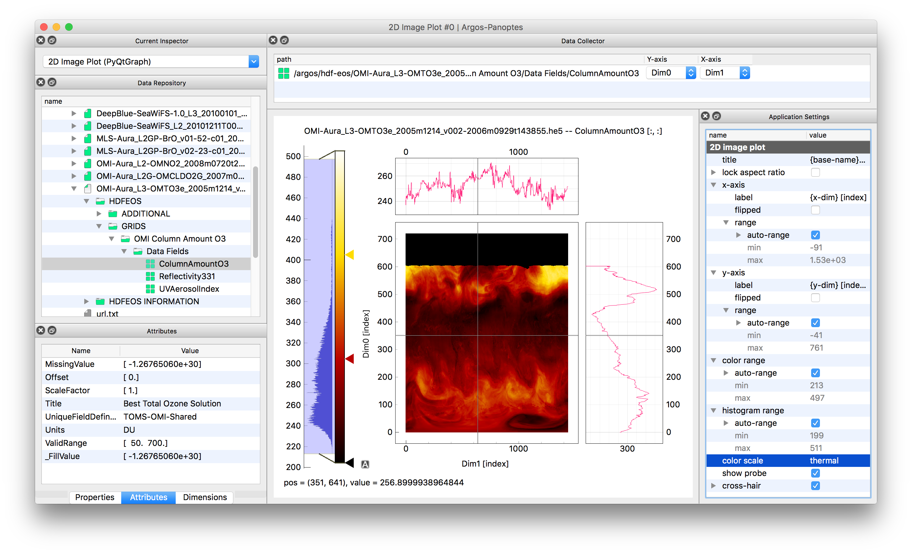

Argos
==========

Argos is a GUI for viewing and exploring scientific data, written in Python and Qt. It has a
plug-in architecture that allows Argos to be extended to read new data formats. At the moment
plug-ins are included to read HDF-5, NetCDF-4, WAV, numpy binary files, and various image formats,
but a plug-in can be written for any data that can be expressed as a Numpy array.

### Installation:

Argos requires at least Numpy and PyQt5. It is strongly recommended to also install PyQtGraph
(version 0.10.0 or higher) which is required to visualize the data as image or line plots. Without
PyQtGraph the data can only be examined as tables or text.

Argos works with Python 2.7 or Python 3.4 and higher. Provided you use Python 3.5 or higher, you
can install PyQt5 with `pip`. Otherwise you can download it at the
[Riverbank site](https://www.riverbankcomputing.com/software/pyqt/download5).

    %> pip install PyQt5
    %> pip install numpy
    %> pip install pyqtgraph
    %> pip install argos

The following are optional. You only need to install them if you want to read the corresponding
file formats. They can be installed with `pip install <library>` or download from their website.

| Python library                                       | File formats                    |
|----------------------------------------------------- |---------------------------------|
| [h5py](www.h5py.org)                                 | HDF-5                           |
| [netCDF4](http://unidata.github.io/netcdf4-python/)  | NetCDF 3 and 4                  |
| [Pillow](https://python-pillow.org/)                 | BMP, JPEG, PNG, TIFF, GIF, etc. |
| [scipy](https://www.scipy.org/)                      | Matlab & IDL save-files. WAV    |
| [pandas](https://www.pandas.org/)                    | Comma-separated files           |


After installation, Argos can be started from the command-line with.

```
    %> argos
```

Argos

### User interface:



