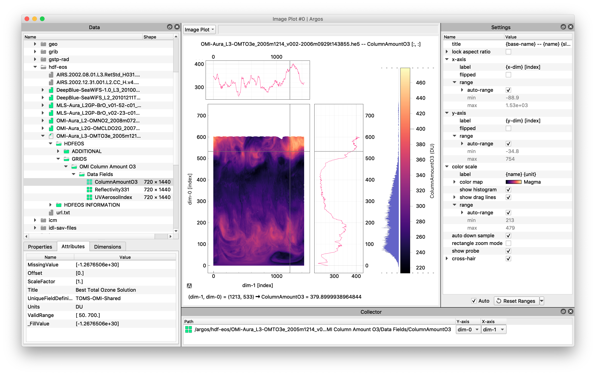
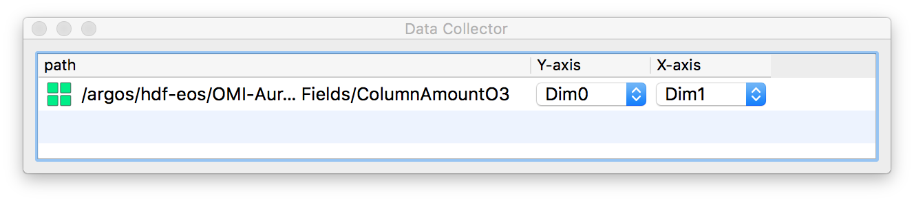
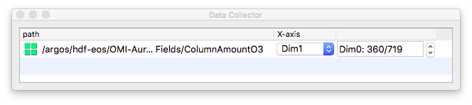
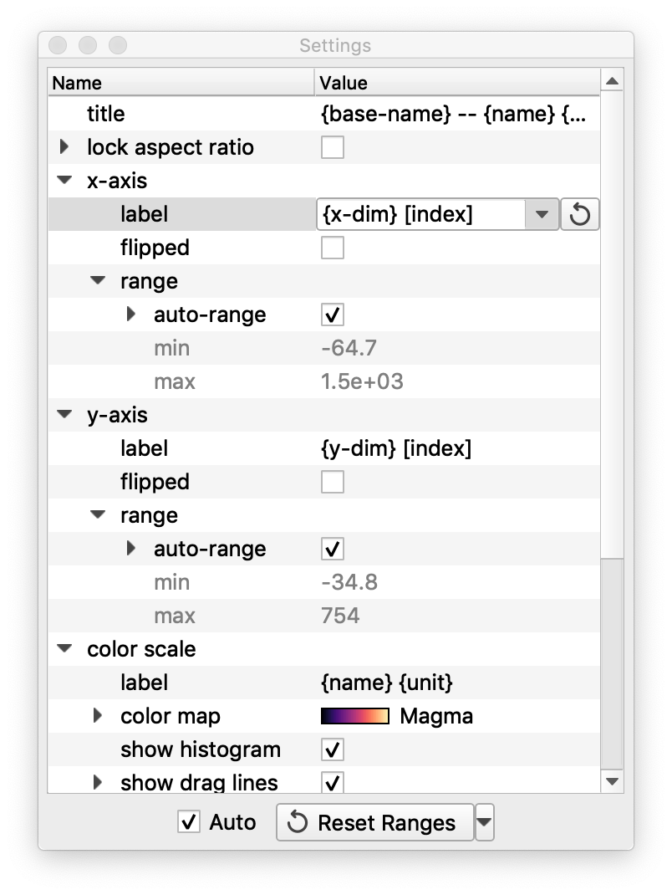
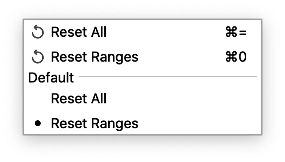
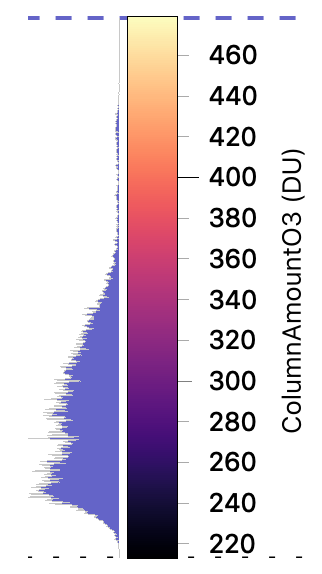

Argos
==========

Argos is a GUI for viewing and exploring scientific data, written in Python and Qt. It has a
plug-in architecture that allows it to be extended to read new data formats. At the moment plug-ins
are included to read HDF-5, NetCDF-4, WAV, Exdir, numpy binary files and various image formats, but
a plug-in could be written for any data that can be expressed as a Numpy array.


### Installing Argos

Argos works with Python 2.7 or Python 3.4 and higher. If you don't have Python yet, consider to
use the [Anaconda Python distribution](https://www.continuum.io/downloads), as it comes with many
of Argos' dependencies installed.

Argos requires at least [PyQt5](https://www.riverbankcomputing.com/software/pyqt/intro) and
[Numpy](http://www.numpy.org) and [CmLib](https://github.com/titusjan/cmlib). It is strongly
recommended to also install [PyQtGraph](https://pyqtgraph.org) and
[PgColorBar](https://github.com/titusjan/pgcolorbar), which are required to visualize the data as
image plots or line plots. Without them the data can only be examined as tables or text.

The following dependencies are **optional**. You only need to install them if you want to read the
corresponding file formats.

| Optional Python package                              | File formats                    |
|------------------------------------------------------|---------------------------------|
| [h5py](http://www.h5py.org)                          | HDF-5                           |
| [netCDF4](http://unidata.github.io/netcdf4-python/)  | NetCDF (v3 and v4)              |
| [pillow](https://python-pillow.org/)                 | BMP, JPEG, PNG, TIFF, GIF, etc. |
| [scipy](https://www.scipy.org/)                      | Matlab & IDL save-files. WAV    |
| [pandas](http://pandas.pydata.org/)                  | Comma-separated files           |
| [exdir](https://github.com/CINPLA/exdir)             | Exdir                           |


#### Installing Argos with Pip

Provided you use Python 3.5 or higher, you can install PyQt5 with `pip`. Otherwise you can download
it at the [Riverbank site](https://www.riverbankcomputing.com/software/pyqt/download5).

    %> pip install PyQt5
    %> pip install argos

After that, install the optional dependencies with `pip install <package>`.


#### Installing Argos with Anaconda

Argos is available at the conda-forge channel. To install it type:

    %> conda install pyqt
    %> conda install -c conda-forge argos

After that, install the optional dependencies with `conda install <package>` (or
`pip install <package>` for exdir).


### Starting Argos

After installation, Argos can be started from the command-line with

```
    %> argos [FILE [FILE ...]]
```

where `[FILE [FILE ...]]` are zero or more files or directories you want to view.

For a complete list of command line options, run argos with `-h'.

```
    %> argos -h
```


#### Trouble shooting

If you start `argos` and nothing happens, you probably didn't install `PyQt` or `numpy`. You can
try to start argos as follows to get more information

```
    %> python -m argos
```

#### Resetting Argos

At start-up, Argos reads some persistent settings (window position and size, plot settings, etc)
from a configuration file so that you can continue where you left off the previous session.

If, for some reason, you want Argos to reset to its initial state, you can simply delete this
config file before starting Argos (please make a backup just in case). Argos will then start with
the original configuration.

The configuration file is called `settings.json` by default. Its location is platform dependent:

```
	Windows: C:\Users\<user>\AppData\Local\titusjan\argos
	MacOS: ~/Library/Preferences/titusjan/argos
	Linux: ~/.config/titusjan/argos
```

Note that this directory might be hidden. For convenience you can open this directory in a
file browser by selecting `Configure | Show Config Files...` from the Argos main menu.


### Using Argos

The Argos main window consists of a central panel that holds a visualization, and some smaller
windows that surround the main panel. The smaller windows can be moved around by dragging them by
their title bar. They can be separated from the main window or can be docked at an at another
position. Collectively they are called the dock panels. You can show and hide them via the
`View | Panels` main menu (although there is typically no need to do so).



The main panel is called the (data) Inspector. From the `View` main menu you can select one of the
following inspector types: _Line Plot_, _Image Plot_, _Table_, or _Text_ inspector. The current
inspector type is shown in the menu button above the inspector panel. Clicking this button (or
pressing ctrl-I) is an alternative way of selecting a different inspector.

If you want to have multiple inspectors open at the same time, you can select `New Window` from the
`File` menu.


#### Selecting Data

Note: the HDF5 file that is used in the screenshot and in the examples below can be
downloaded [here](http://www.hdfeos.org/zoo/index_openGESDISC_Examples.php#OMI) (2.4 MB).
More (NetCDF4) example data can be found at the UCAR site
[here](https://www.unidata.ucar.edu/software/netcdf/examples/files.html).

The `Data` dock panel displays the list of files and directories that are loaded and are available
for inspection. The repository has the form of a tree, or more precisely a list of trees (a forest).
You can add files by selecting the `Open Files` from the `File` menu, and add directories with the
`Browse Directory` option. Argos uses the file extension to determine which plug-in to use for
opening the file. The icon color of the tree items indicates which plug-in was used. With the
`Open as` menu option you can force Argos to open a file with the a certain plug-in. If a plug-in
raises an error while opening a file, it will get a red triangle as icon (hover over the item to
get a tool-tip with the error message).

Expanding the items in the tree will automatically open the underlying files. Collapsing
an item will close the file again. Right-clicking the item will bring forward a context menu that
makes it possible to collapse the item without closing the underlying file, to reload the file, or
to open the file with a different plug-in.

Note that the data repository is shared between all Argos main windows. That is, opening a file
will add a new item to the `Data` tree of all open windows.


#### Slicing Data

Selecting an item in the tree will automatically place it in the `Collector` table at the bottom
right of the windows. If the item contains numerical data, drop-down and spinbox widgets will appear
in the table. These enable you to specify a slice of the data that the inspector will then
visualize.

In the screen shot for example, the `ColumnAmountO3` HDF-5 dataset is selected and placed in the
collector. This is a two-dimensional data array, it contains a world wide distribution of ozone in
the atmosphere. The first dimension corresponds to longitude, the second to latitude. These
dimensions have no name since the dataset has no associated [dimension
scales](http://docs.h5py.org/en/latest/high/dims.html). Therefore, Argos just calls them `dim-0`
and `dim-1`.

The inspector in the screen shot is an `Image Plot`. This is a two-dimensional inspector so there
will appear two drop-down box in the table: the first specifies which dimension will be mapped onto
the Y-axis (`dim-0` in the example) and the second determines the data dimension that is mapped to
the X-axis.



When you select the `Line Plot` inspector from the View menu or the Inspector button, the selected
data will be drawn as a line plot. A line plot can only show one-dimensional data, but because
since the example data is two-dimensional only a sub-slice of the dataset can be visualized. The
collector will therefore contain a drop-down box for specifying which data dimension will be laid
along the X-axis, and a spinbox-slider combination for selecting the index of the other dimension.
Below you see the case that the line plot will draw row 360. By the way, this is reflected in the
plot title, which will be `ColumnAmountO3[360, :]`).



By default Argos will put the first array dimension(s) in the spinbox(es), and select the fasted
changing array dimension(s) in the drop-down box(es).

#### Inspecting Data and Configuring the Visualization

The `Settings` dock panel, located at the top right, contains settings for configuring the current
inspector. If you click on a config value, an appropriate widget will appear for editing, together
with a reset button  that will
reset the config value to its default when clicked.

The settings are hierarchical so that related settings are grouped together in a branch. Branches
also have a reset button that resets the complete branch. For instance by clicking on the reset
button of the `y-axis` config value branch, all settings pertaining to the Y-axis are reset.



Note that some branches are collapsed by default to hide the infrequently used settings and reduce
clutter. For instance the `cross-hair` item can be expanded for further tweaking of the cross-hair
plots.

When you click on the `Reset Ranges` button at the bottom of the Settings panel, all settings that
are related to the data range (such as the range of the axes and the color scale) are reset to their
default values. This gives you a convenient way to go back to viewing all the data after zooming in.
Pressing `Ctrl-0` has the same effect.

If the `auto` checkbox is checked, the _Range_ settings are automatically reset every time you
select a new item in the Data tree or select a new axis in drop-down box in the data Collector
panel. Normally this is desired behavior because a new dataset or axis will have a totally different
data range. Unchecking the auto scale checkbox allows you to retain the axes range settings, which
can be useful in case you are switching to a related dataset with the same data extent.

If you want to reset all inspector settings you can click on the triangle next to the `Reset
Range` button and select `Reset All` in the context menu that appears. The menu also allow you to
change the default action of the button.



A few of the inspector settings are explained below. It is not a complete list, many of the settings
will be clear from their name. I also urge you to experiment yourself by just trying new values.
You can always go back by using the `Reset All` option as described above.

#### Line Plot Inspector

The `Line Plot` inspector contains a single line plot, which uses
[PyQtGraph](http://www.pyqtgraph.org/) the underlying plot engine.

You can move (pan) the plot by dragging it while holding the left mouse button. Dragging with the
right mouse button zooms in or out. If you drag while your mouse cursor is above the X or Y axis,
panning and zooming will be only done in that direction. Zooming can also be done by scrolling your
mouse-wheel while the cursor is above the plot or axes. In addition, you can employ a rectangle
zoom mode by checking the `rectangle zoom mode` checkbox in the the settings panel. In this mode
dragging with the left button will draw a rectangle, which will subsequently be used as the new
plot range.

To reset the plot range you can click the middle mouse button anywhere on the plot (or one of the
axes). You can also reset it by clicking the small button labeled 'A' in the lower left corner of
the figure. Finally, right clicking on the plot will pop up a context menu from which the plot
range can also be reset.

If the axis auto-range mode is on, the axis' range is calculated from the data. By default this is
delegated to PyQtGraph, but by setting the `y-axis/range/autorange/method` option, you can let the
auto-range method discard a certain percentage of the outliers.

If the axis auto-range mode is off, you can set the axis' range manually in the `range/min` and
`range/max` options. The range will remain fixed if you select a new slice with the spinbox.
Autorange will be turned off as soon as you zoom or pan the data. You can turn it on again in the
`range/autorange` option, or by resetting the axis' plot range as described above.

The plot title can be modified with the `title` config option via an editable combobox widget. You
can enter any title you want but be aware that the title may be incorrect as soon as you pick a
new item from the Data tree. Therefore a few properties can be written in between braces.
These will then be updated dynamically whenever a new data item is selected. For example, `{name}`
will be substituted with the name of the selected item.

*   `{name}`     : name of the selected item from the Data tree.
*   `{path}`     : full path of the items leading up to the selected item. Might be long!
*   `{base-name}`: name of the file that contains the item.
*   `{dir-name}` : directory of the file that contains the item. Might be long!
*   `{file-name}`: full file name (dir-name + '/' + base-name). Might be long!
*   `{slices}`   : information about the selected array slice in Numpy notation. E.g. `[360, :]`
*   `{unit}`     : the unit of the item in parenthesis, or the empty string if no unit is available.
*   `{raw-unit}` : the unit of the item as-is, that is, without parenthesis.

Furthermore, PyQtGraph uses HTML for the plot title so you can make fancy titles such as
`<small>{name} <span style="color:#FF0066">{slices}</span></small>`. This also means that you must
escape the `<`, `>` and `&` characters by using `&lt;`, `&gt;`, `&amp;` instead!

The `x-axis/label` and `y-axis/label` settings can be edited in the same way as the `title`.

The editable comboboxes will remember entered values. If you want to remove an item from a
combobox, highlight it in and then press delete. You can also press `Ctrl-Del` while you are
editing to remove the current item.

The `pen` settings branch holds config items that determine how the plot curve is drawn. Make sure
you have at least one of the `line` and `symbol` checkmarks checked, or the curve will be
invisible. Anti-aliasing is turned on by default. This can be slow, especially in combination with
a line width other than 1.0, so if you have large plots you might want to turn it off.

#### Image Plot Inspector

This inspector shows an image plot and optional cross-hair line plots that show cross sections of
the data at the cursor (see the screen shot at the top of this document).

Panning, zooming and setting the plot titles work in the same manner as for the Line Plot
inspector. Next to that, the image plot has a `color scale` that determines the minimum and maximum
values of the color scale. Its range, too, can be in auto-range mode, or can be set manually.



The range of the color scale can also be manipulated by panning and zooming the color scale as follows:

* **Pan the range:**
    Drag the scale up or down with the left mouse button to move the color range. This changes the
    intensity of the colorized image.
* **Zoom the range:**
    Drag the scale using the right mouse button, or scroll with the mousewheel when the cursor is
    above the scale. This makes the extent of the scale larger or smaller and so changes the
    contrast of the colorized image.
* **Change the range at one side only:**
    Hover the cursor over one of the dashed horizontal lines (located at the edges of the color
    bar) until it becomes wider and the cursor changes. Then drag the line up or down. The range
    will change only at that end-point while the other end-point remains the same. Note that the
    _drag lines_ might be hidden with the `show draglines` setting but they still will appear if
    the cursor hovers above them. The `show draglines/margins` option allows you to increase white
    space around the color bar so that you have more room for dragging.
* **Reset the range:**
    Click the middle mouse button (or mouse wheel) while the cursor is above the scale to reset the
    color range.

Next to the color scale you see a side-ways histogram, which gives an indication of how many pixels
have a certain value. This may assist you in choosing the best color range. The histogram can be
hidden by unchecking the `color scale/show histogram` setting.

Argos comes with a large collection of color maps. The current color map can be changed with the
`color scale/color map` setting. The drop-down box contains a small selection of user-favorite
color maps. The ellipsis button (`…`) next to will bring forward a dialog window which contains a
table with all the available color maps. You can add color maps to the favorites by checking the
check box in the left most column of the table (labeled ★). See the [CmLib
documentation](https://github.com/titusjan/cmlib#cmlib) for more details.

By checking the `cross hair` config option you can bring up two line plots to the side of the
figure (see the screen shot at the top). A horizontal and vertical line are drawn at the cursor
position and the plots will contain a cross-section of the values along those lines.

#### Table Inspector

This inspector is useful for examining the exact values of your data. You can change the size of
the table cells via the `row height` and `column width` settings. By checking the
`auto row heights` and/or the `auto column widths` check boxes, you can configure the table
inspector to calculate the cell sizes dynamically from their contents. Note that this can be slow
for large tables. So, as an optimization, if the table has more than 1000 elements only the
currently selected cell is used to calculate the height and width, and this is applied to all other
cells. If a table has more than 10000 rows or columns, auto resizing is disabled.

If your selected data item is a structured array, i.e. an array having fields, all fields are
displayed in a separate column by default. If you uncheck the `separate fields` checkbox, all
fields of are combined in a single cell as follows: `(field1, field2, ...)`.

You can change how the data in the cells is formatted with the config options under the
`format specifier` branch. Which setting is used depends on your data type: the `integers` format
setting is used if the data in the cell is an integer, `other numbers` is used for floating point,
rational, or complex numbers; and any data that is not a string or a number is formatted with the
`other types` format code. For instance, setting the `other numbers` to `.2e` will display all
floating point data in scientific notation with two digits behind the decimal point.

The format codes must be a `format_spec` from the new-style Python formatting. You can think of
them as new-style formatting codes, but without the braces and the colon. If you want to use a
complete format string, i.e. _with_ the braces and the colon, you must put your format string
between quotes. For example, using `'hello {:.2e}'` will prepend "hello" to the data values. Take
a look at [this page](https://pyformat.info/) or the Python documentation
[Format Specification Mini-Language](https://docs.python.org/3/library/string.html#format-specification-mini-language)
to see what's possible.

#### Text Inspector

The `Text` inspector contains a _read-only_ text editor widget that shows the contents of a single
array element. If your data consists of large strings, especially strings of multiple lines,
examining it in a text editor works better than using a table and resizing the cell sizes. Also
the `word wrap` settings has more options here. To see this for yourself, download the example file
from the screenshot [here](http://www.hdfeos.org/zoo/index_openGESDISC_Examples.php#OMI) (2.4 MB),
and look at the `HDFEOS INFORMATION/StructMetadata.0` dataset in both the table inspector and the
text inspector.


#### Viewing Metadata

At the bottom of the Data panel, in the lower left corner of the screen shot, are two tabs that
contain meta data of the item that is currently selected in the tree.

The `Attributes` tab lists the attributes of items from HDF or NetCDF files. Other file formats may
contain similar meta data, which will also be displayed here.

The `Properties` tab contains a list of properties, such as the shape and element-type of the
selected item. In contrast to the `Attributes` this list is fixed; all data items always have the
same list of properties (although their contents may be empty). These properties, by the way, can
be added as columns in the Data tree via `View | Table Headers | Data` in the main menu.
